# Graphs Poster UFMG 2023

## Poster PDF

[Poster](posterUFMG2023.pdf)

[XI BRAZILIAN MEETING ON SIMULATIONAL PHYSICS](https://www.fisica.ufmg.br/bmsp/)

# Model Animation

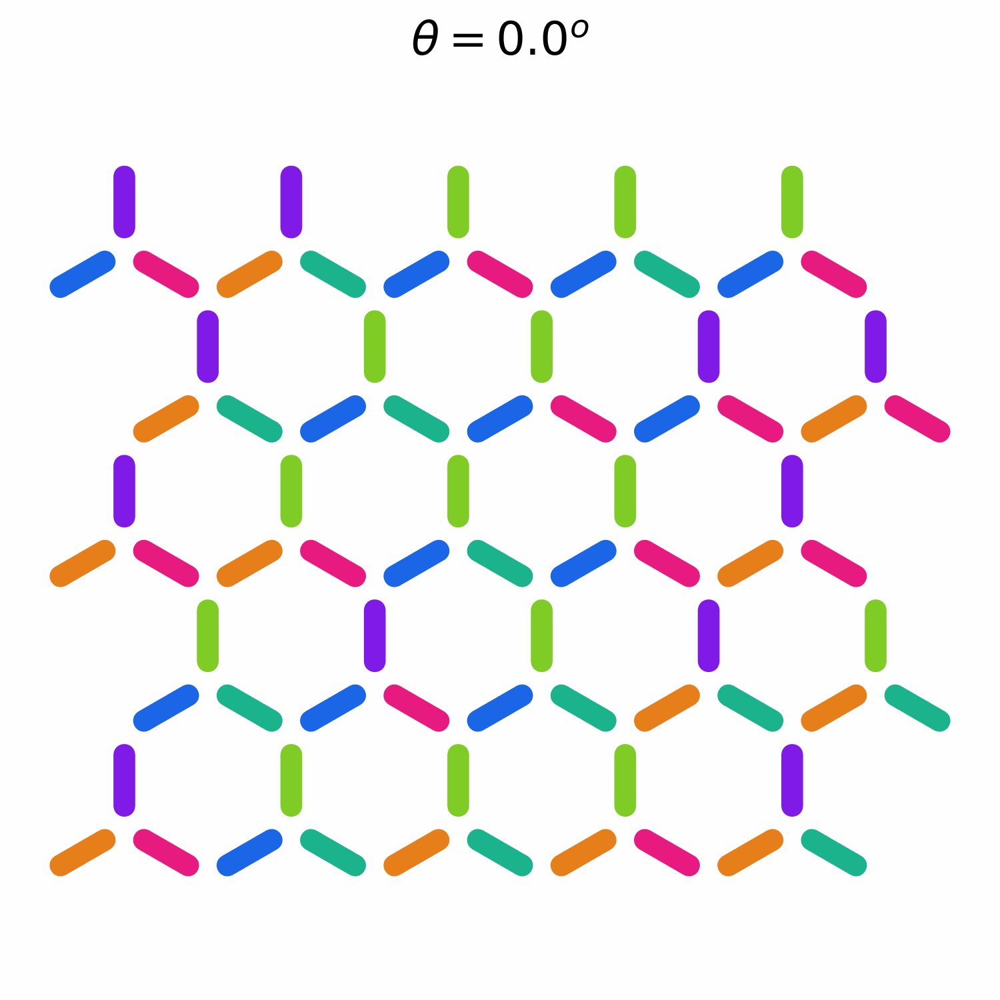

We used a flatspin simulator to generate only the configuation's images.

[flatspin: A large-scale artificial spin ice simulator](https://link.aps.org/doi/10.1103/PhysRevB.106.064408)

## Worms' Acceptance Rate

 
 

 
 

 
 

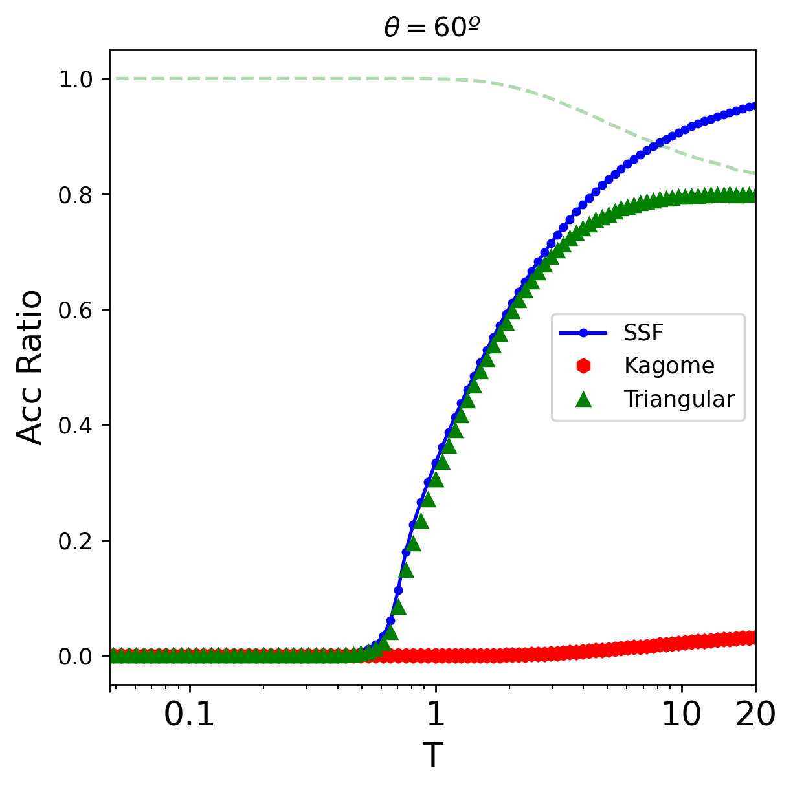

 
 

## Specific Heat, Entropy and MSSF

 
 

 
 

 
 

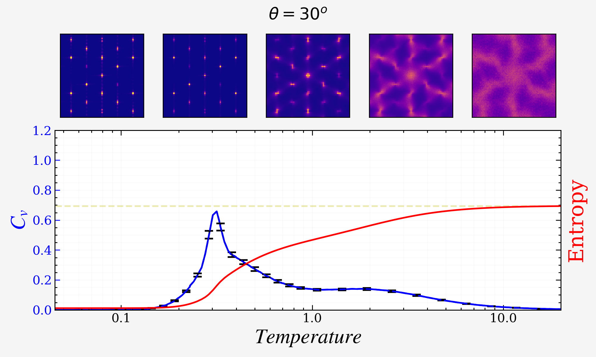

 
 

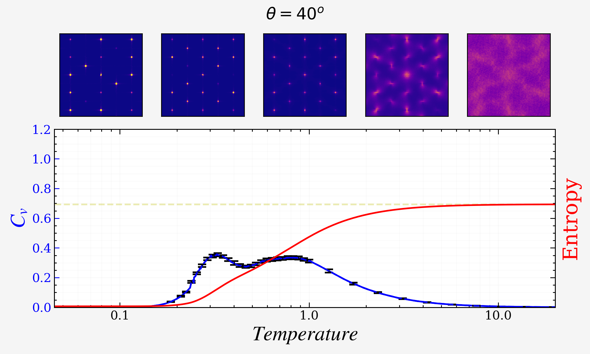

 
 

 
 

 
 

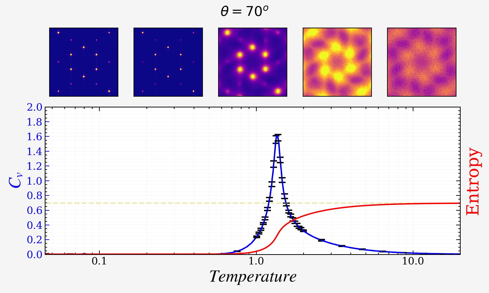

 
 

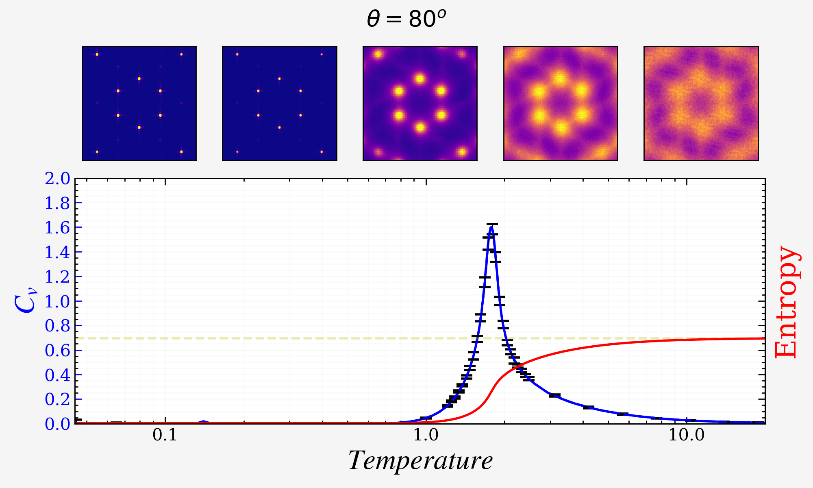

 
 

 
 

## Charge Population

### Kagome Charges

### Triangular Charges

 
 
 
 
 

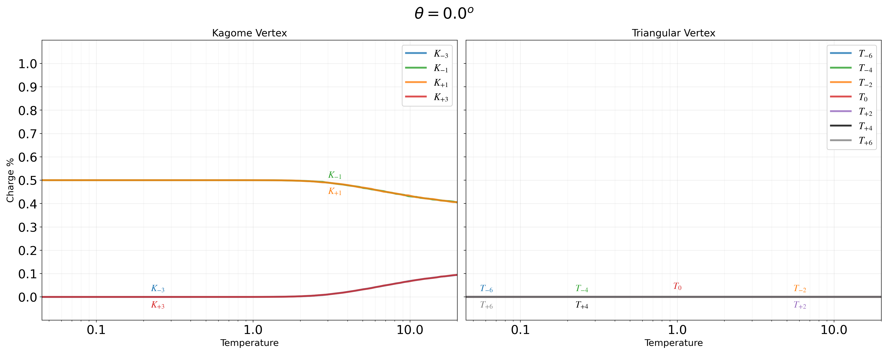

 
 

 
 

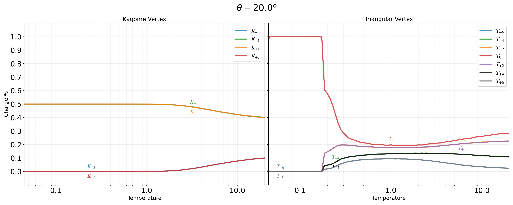

 
 

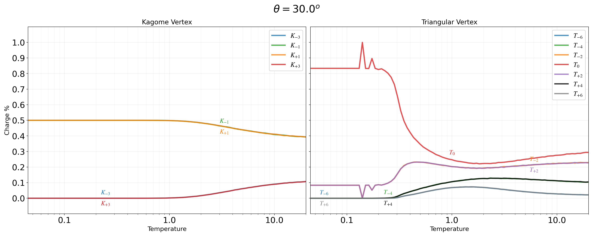

 
 

 
 

 
 

 
 

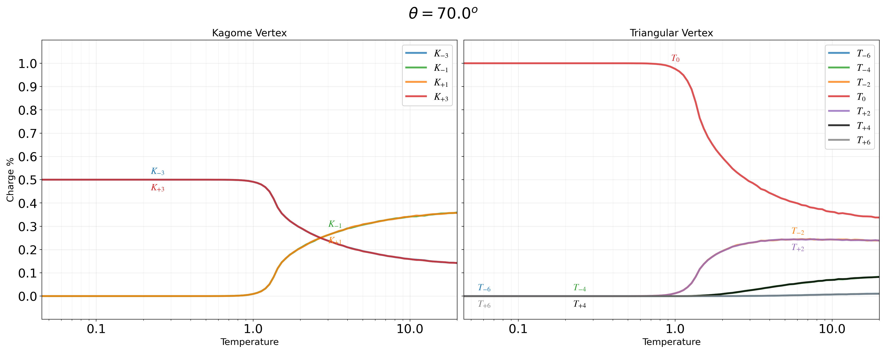

 
 

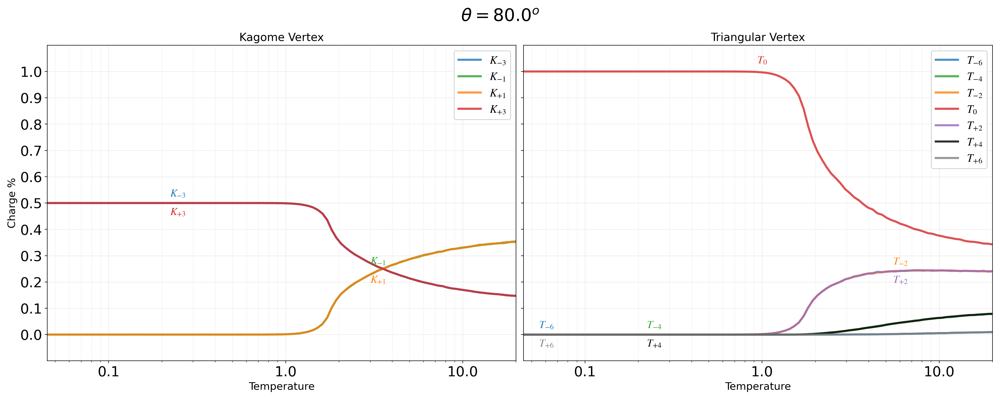

 
 

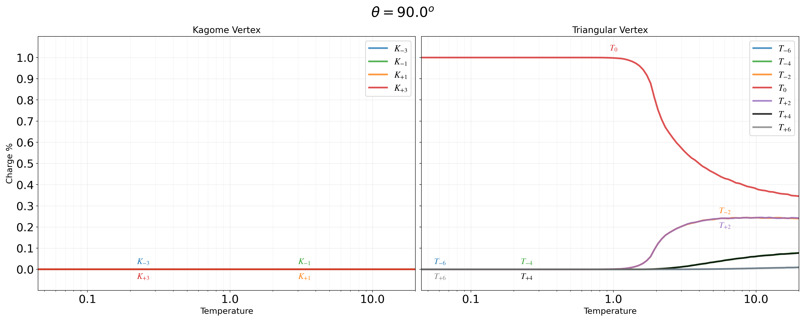
